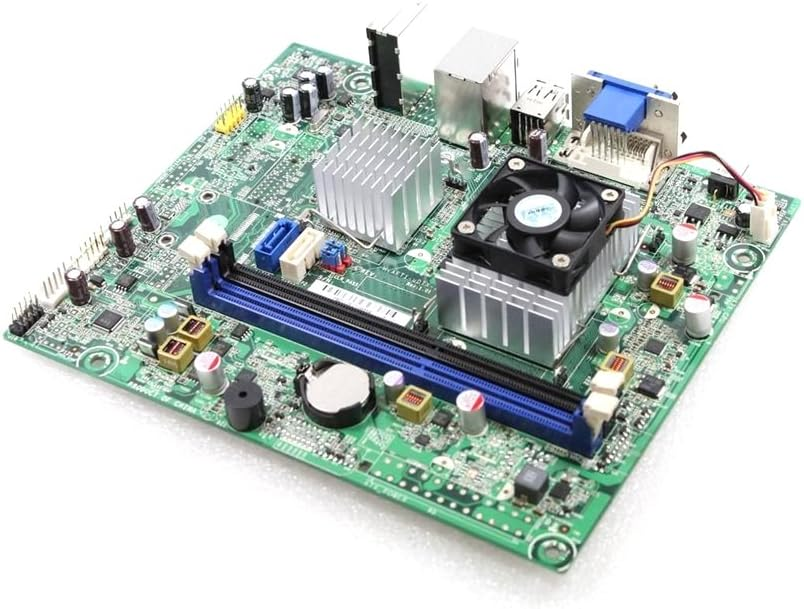
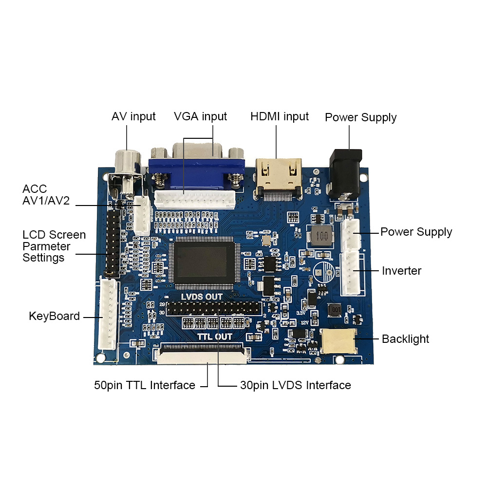
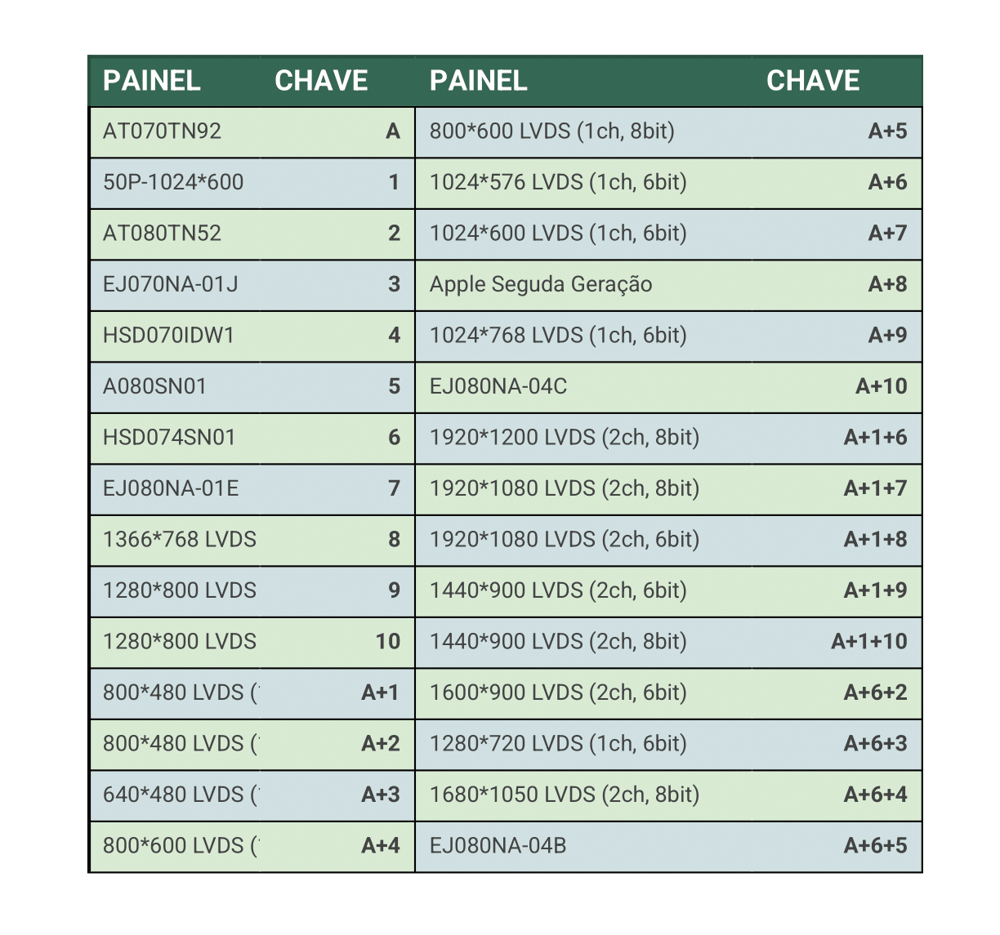
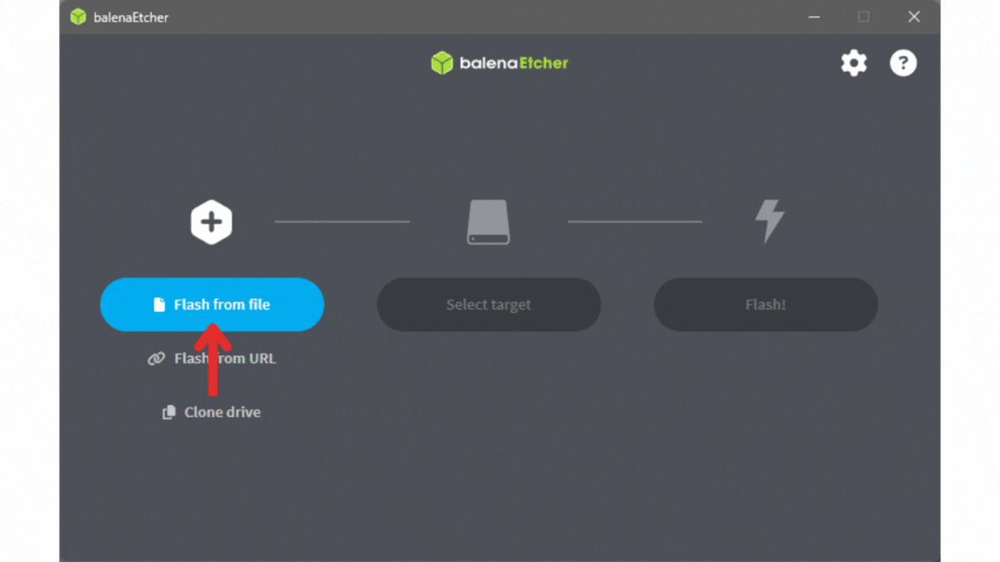

# Arc-E350

Este projeto foi desenvolvido com o intuito de dar um novo propósito ao meu primeiro computador, transformando-o em uma central de emulação. Considerando a dificuldade de acesso a consoles antigos e suas mídias físicas, o Arc-E350 surge como uma alternativa acessível, prática e nostálgica para reviver clássicos dos videogames. Este documento serve como uma apresentação e tutorial do projeto.

---

## 📑 Sumário

- [Hardware Utilizado](#hardware-utilizado)
  - [H-AFTI uDTX-1 (computador de baixo consumo)](#h-afti-udtx-1-computador-de-baixo-consumo)
  - [PCB800099-V9 (Controlador LVDS / TTL)](#pcb800099-v9-controlador-lvds--ttl)
- [Sistema Operacional e Configurações Básicas](#sistema-operacional-e-configurações-básicas)
  - [Batocera](#batocera)
- [Construção do Arcade](#construção-do-arcade)
- [Recomendações](#💡-recomendações)
- [Considerações Finais](#📌-considerações-finais)

---

## 💻 Hardware Utilizado

### H-AFTI uDTX-1 (computador de baixo consumo)

- 2GB RAM DDR3 1066MHz
- Processador AMD Dual Core E-350
- SSD 120GB

### PCB800099-V9 (Controlador LVDS / TTL)

- Tela LCD de 8" (retirada de um tablet antigo)
- Conexões compatíveis com a tela e alimentação
- Seleção de firmware para diferentes resoluções

  

---

## 🖥️ Sistema Operacional e Configurações Básicas

### Batocera

- **Instalação**

  - [Etcher](https://etcher.balena.io/)
  - [Download Batocera](https://batocera.org/download)

- **Configuração Inicial**

  - Pressione `Esc` ou `Start` para abrir o Menu Principal
  - Vá em `System Settings -> Language` e selecione `Português Brasileiro`
  - Para manipulação de arquivos, use `F1` com teclado e mouse ou acesse via rede pelo IP da máquina
  - Vá em `Menu Principal -> Ajustes de Rede` e acesse o IP em outro sistema via **Putty** ou **Explorer**
    - Credenciais padrão:
      - Usuário: `root`
      - Senha: `linux`

- **Arquivos de BIOS**

  - Vide [Pack BIOS](https://drive.google.com/file/d/1a3KXU5rptyQXOlibsJxuoVryVIDbopnm/view?usp=sharing)
  - Extraia em outro sistema operacional e substitua os arquivos na pasta `share` do Batocera

- **ROMs**

  - Acesse o IP da máquina ou conecte um pendrive com as ROMs
  - Mova os arquivos para as pastas corretas dentro de `share/roms/`

  - **Baixando ROMs**
    - Sites recomendados: `romsfun`, `romsportugues`
    - Use um **AdBlock** para evitar pop-ups
    - Aviso: Não me responsabilizo por qualquer problema ao baixar ROMs online

- **Configuração de Capas para os Jogos**
  - [ScreenScraper](https://www.screenscraper.fr/index.php)
  - Crie uma conta
  - No Batocera, vá em `Menu Principal -> Procurar Mídias de Jogo -> Ajustes do Scraper`, faça login
  - Para baixar as artes:  
    `Menu Principal -> Procurar Mídias de Jogo -> Baixar Agora`

---

## 🕹️ Construção do Arcade

- **Materiais Utilizados e Dimensões Gerais**  
  Projeto pensado para corte a laser em MDF de 3mm

- **Arquivos**

  - `.cdr` – Arquivos para corte a laser (CorelDRAW)
  - CorelDRAW web - Acesso de 16 dias Grátis.

- **Visualização e Montagem**
  - [Projeto no TinkerCAD](https://www.tinkercad.com/things/cSyrsDrk72K-arce350?sharecode=hKJ7t1MmlwgPOkPFgt--RSSKy72yJf3bz6QZY0FlY2w)

---

## 💡 Recomendações

É de suma importância um bom sistema de arrefecimento da máquina. No arcade há dois espaços para fans de 40mm e um para fan de 80mm.  
Recomendo também o uso de um cabo de vídeo do modelo flat para ocupar menos espaço na traseira do arcade.

O projeto pode ser adaptado para utilizar um hardware mais forte. Vale olhar os computadores da linha **ThinkCentre**, pois as dimensões do PC se encaixam no gabinete do arcade.

---

## 📌 Considerações Finais

O **Arc-E350** é mais que uma estação de jogos retrô: é um projeto pessoal que ressignifica um equipamento antigo, promovendo sustentabilidade, criatividade e diversão. Com o avanço das plataformas open-source, criar sua própria central de emulação nunca foi tão acessível.

Agradeço à equipe do **Batocera** por desenvolver um sistema tão completo no quesito retro gaming.  
Quaisquer alterações nesse projeto são bem-vindas! Só peço que me deem os devidos créditos ao utilizarem o gabinete do arcade.

---
